# A3 Report

Author: Mohammed Sohail Ahmed

Date: 2024-02-28

Check [readme.txt](readme.txt) for course work statement and self-evaluation.

## Q1 Web service project (programming)

### Q1.1 SOAP WS

Complete? Yes

<!--If you answer Yes, insert a screenshot image to show the completion. -->

{width=90%}

<!--If No, add a short description to describe the issues encountered.-->

### Q1.2 SOAP WS clients

Complete? Yes

<!--If you answer Yes, insert a screenshot image to show the completion. -->

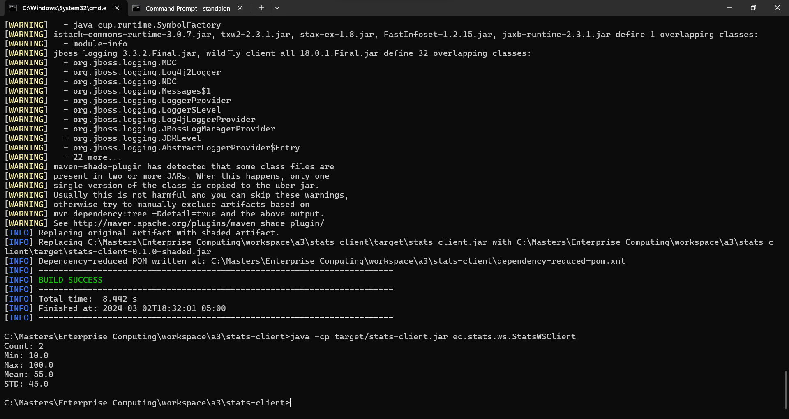{width=90%}
{width=90%}
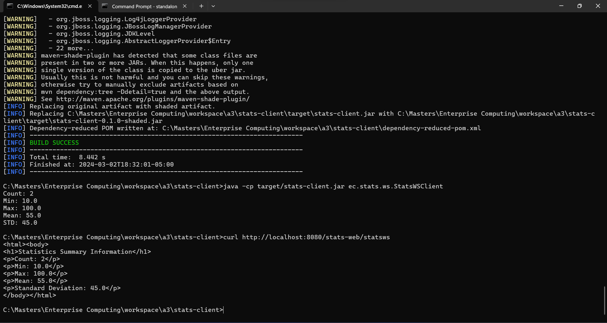{width=90%}

<!--If No, add a short description to describe the issues encountered.-->

### Q1.3 RESTful Web service

Complete? Yes

<!--If you answer Yes, insert a screenshot image to show the completion. -->

{width=90%}
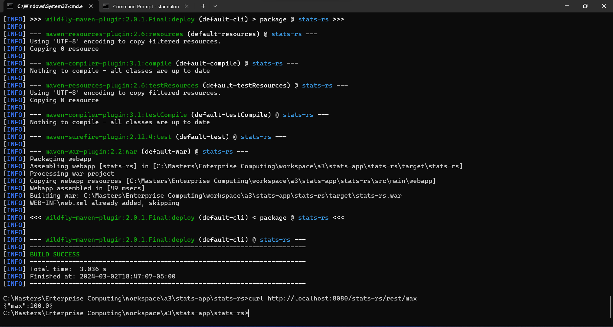{width=90%}
{width=90%}
{width=90%}
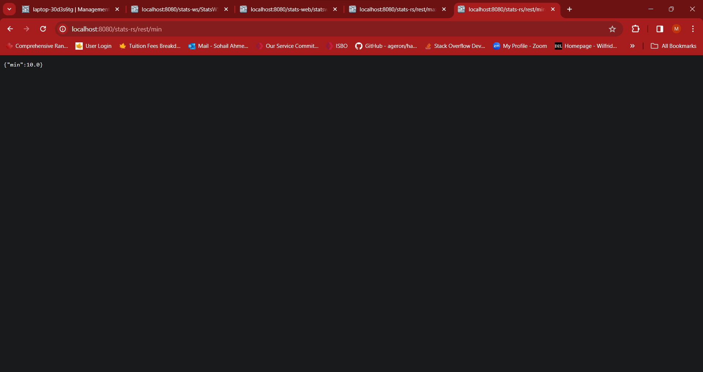{width=90%}
{width=90%}
{width=90%}
{width=90%}

<!--If No, add a short description to describe the issues encountered.-->

## Q2 Linear regression for EC (programming)

### Q2.1 Weka API programming

Complete? Yes

<!--If you answer Yes, insert a screenshot image to show the completion. -->

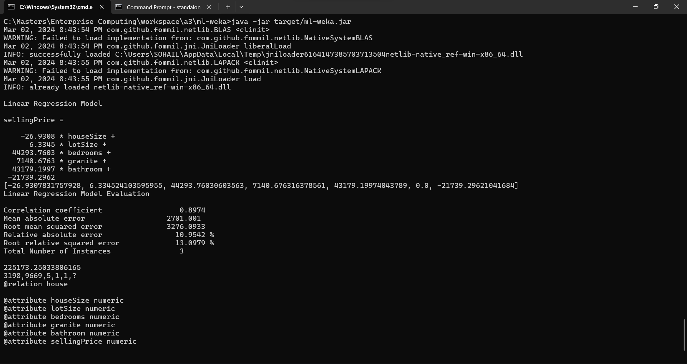{width=90%}
{width=90%}
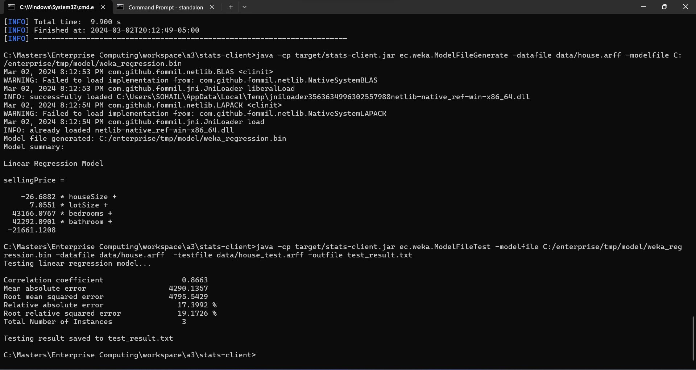{width=90%}
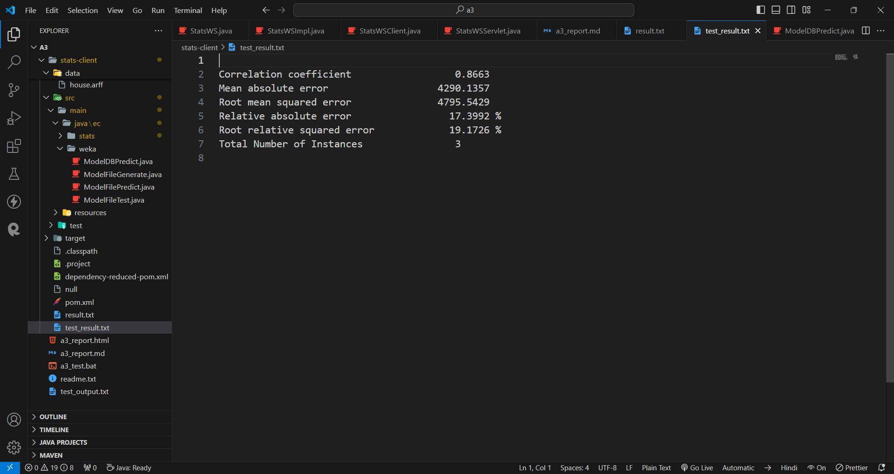{width=90%}
{width=90%}
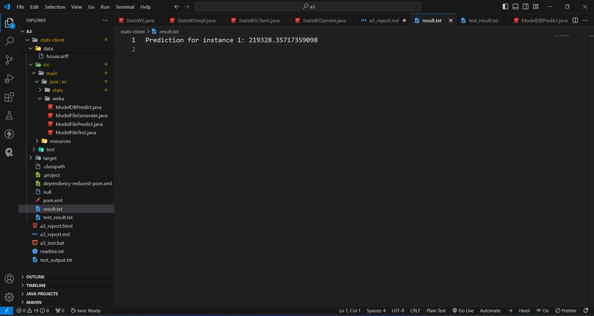{width=90%}

<!--If No, add a short description to describe the issues encountered.-->

### Q2.2 LR Model in Database

Complete? Yes

<!--If you answer Yes, insert a screenshot image to show the completion. -->

{width=90%}
{width=90%}

<!--If No, add a short description to describe the issues encountered.-->

### Q2.3 LR Session Bean Component

Complete? Yes

<!--If you answer Yes, insert a screenshot image to show the completion. -->

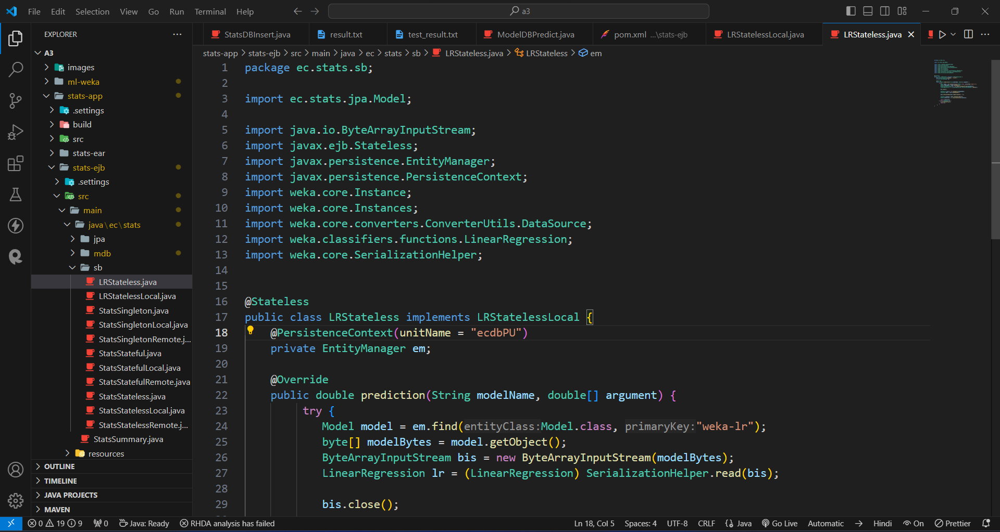{width=90%}
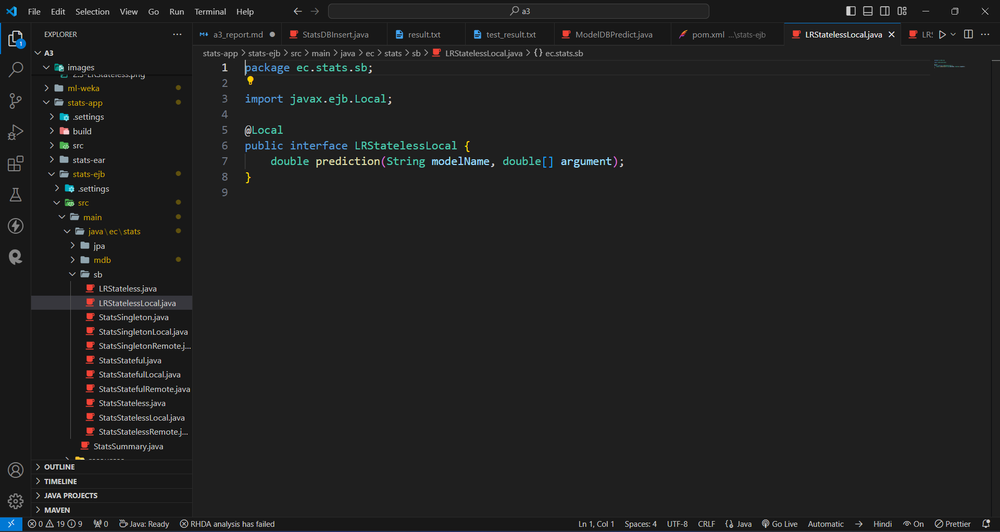{width=90%}
{width=90%}

<!--If No, add a short description to describe the issues encountered.-->

### Q2.4 LR Web Component

Complete? Yes

<!--If you answer Yes, insert a screenshot image to show the completion. -->

{width=90%}
{width=90%}
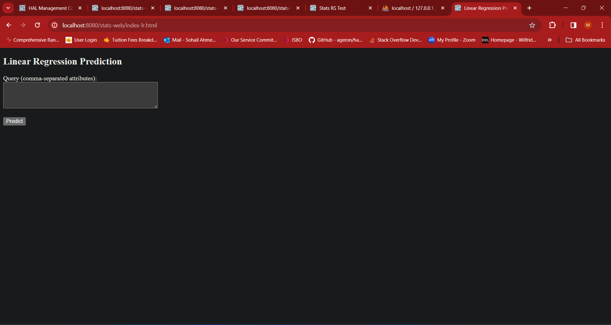{width=90%}
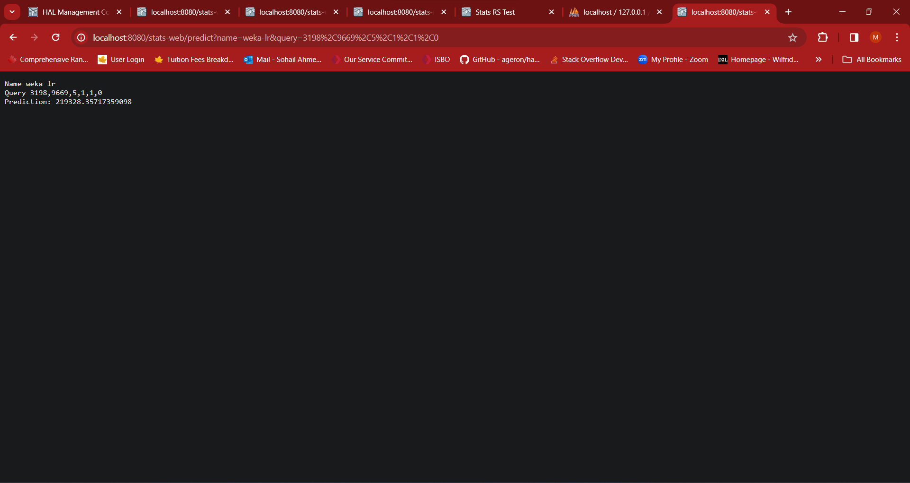{width=90%}

<!--If No, add a short description to describe the issues encountered.-->

## Q3 Batch test (test)

### Q3.1 Create test output

Complete? Yes or No

[test output](test_output.txt)

**References**

1. CP630 a3
2. Add your references if you used any.
