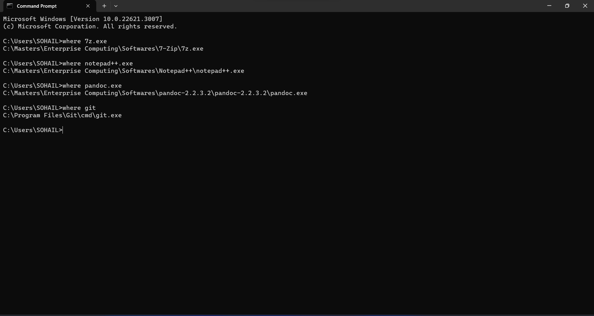
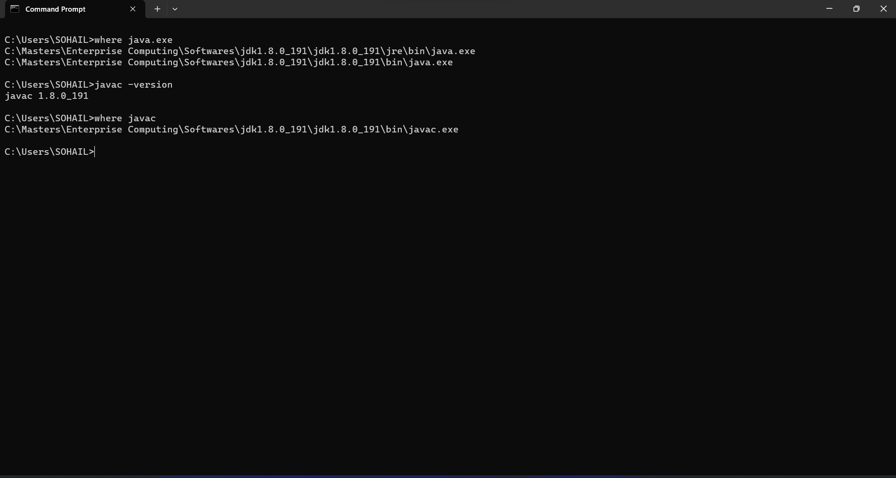
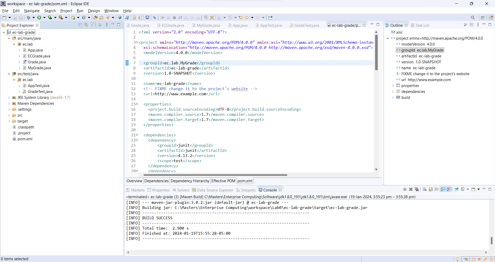
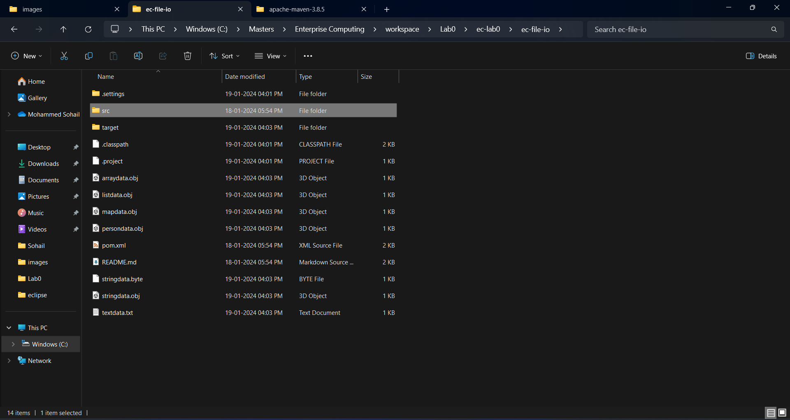
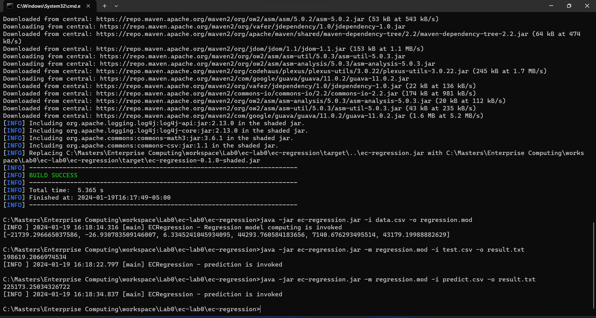

# LAB0 Report

Author: Mohammed Sohail Ahmed

Date: 19-01-2024

Check [readme.txt](readme.txt) for course work statement and self-evaluation.

# T1 Java JRE, JDK, Software Tools (lab practice)

### T1.1 Utility software

Complete? Yes

If you answer Yes, insert a screenshot image to show the completion.

{width=90%}

If No, add a short description to describe the issues encountered.

### T1.2 Java JRE and JDK

Complete? Yes

If you answer Yes, insert a screenshot image to show the completion.

{width=90%}

If No, add a short description to describe the issues encountered.

### T1.3 Apache Ant and Maven

Complete? Yes

If you answer Yes, insert a screenshot image to show the completion.

{width=90%}

If No, add a short description to describe the issues encountered.

### T1.4 Eclipse JEE

Complete? Yes

If you answer Yes, insert a screenshot image to show the completion.

{width=90%}

If No, add a short description to describe the issues encountered.

# T2 Warm up Maven projects (lab practice)

### T2.1 ec-junit-log-mvn

Complete? Yes

If you answer Yes, insert a screenshot image to show the completion.

{width=90%}

If No, add a short description to describe the issues encountered.

### T2.2 Create Maven project

Complete? Yes

If you answer Yes, insert a screenshot image to show the completion.

{width=90%}

If No, add a short description to describe the issues encountered.

### T2.3 Maven project in Eclipse

Complete? Yes

If you answer Yes, insert a screenshot image to show the completion.

{width=90%}

If No, add a short description to describe the issues encountered.

### T2.4 ec-file-io-mvn

Complete? Yes

If you answer Yes, insert a screenshot image to show the completion.

{width=90%}

If No, add a short description to describe the issues encountered.

### T2.5 ec-stats

Complete? Yes

If you answer Yes, insert a screenshot image to show the completion.

{width=90%}

If No, add a short description to describe the issues encountered.

### T2.6 ec-regression

Complete? Yes

If you answer Yes, insert a screenshot image to show the completion.

{width=90%}

If No, add a short description to describe the issues encountered.

**References**

1. CP630 lab0
2. Add your references if you used any.
