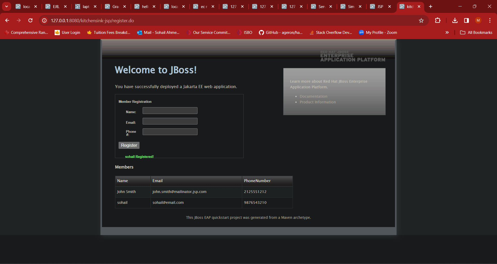
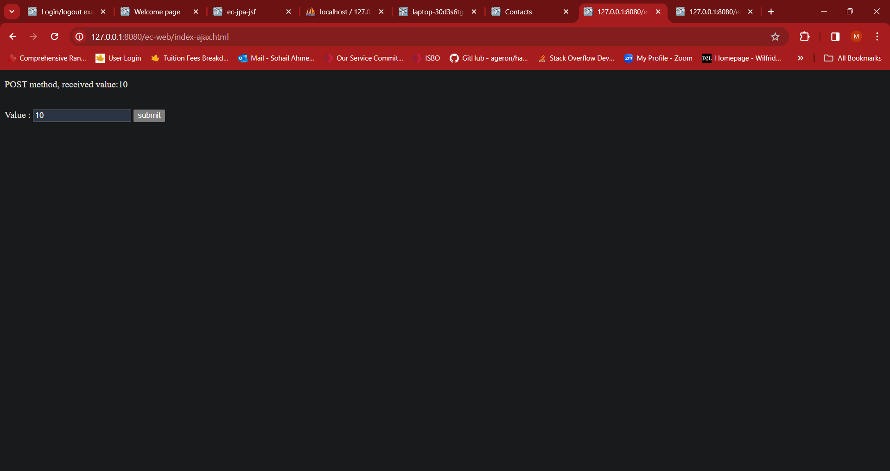

# LAB3 Report

Author: Mohammed Sohail Ahmed

Date: 2024-02-22

Check [readme.txt](readme.txt) for course work statement and self-evaluation.

# T1 SOAP Web Services (lab practice)

### T1.1 Hand on helloworld-ws

Complete? Yes

<!--If you answer Yes, insert a screenshot image to show the completion.-->

{width=90%}
{width=90%}
{width=90%}

<!-- If No, add a short description to describe the issues encountered.-->

### T1.2 ec-ws component

Complete? Yes

<!--If you answer Yes, insert a screenshot image to show the completion.-->

{width=90%}
{width=90%}

<!-- If No, add a short description to describe the issues encountered.-->

### T1.3 ec-ws client

Complete? Yes

<!--If you answer Yes, insert a screenshot image to show the completion.-->

{width=90%}

<!-- If No, add a short description to describe the issues encountered.-->

### T1.4 Accessing SOAP WS by Servlet

Complete? Yes

<!--If you answer Yes, insert a screenshot image to show the completion.-->

{width=90%}

<!-- If No, add a short description to describe the issues encountered.-->

# T2 RESTful Web Services (lab practice)

### T2.1 Hand on helloworld-rs

Complete? Yes

<!--If you answer Yes, insert a screenshot image to show the completion.-->

{width=90%}
{width=90%}
{width=90%}

<!-- If No, add a short description to describe the issues encountered.-->

### T2.2 ec-rs component

Complete? Yes

<!--If you answer Yes, insert a screenshot image to show the completion.-->

{width=90%}
{width=90%}

<!-- If No, add a short description to describe the issues encountered.-->

# T3 Web Tier Components (lab practice)

### T3.1 Servlet Programming

Complete? Yes

<!--If you answer Yes, insert a screenshot image to show the completion.-->

{width=90%}
{width=90%}
{width=90%}
{width=90%}
{width=90%}

<!-- If No, add a short description to describe the issues encountered.-->

### T3.2 Hand on JSP

Complete? Yes

<!--If you answer Yes, insert a screenshot image to show the completion.-->

{width=90%}
{width=90%}
{width=90%}
{width=90%}

<!-- If No, add a short description to describe the issues encountered.-->

### T3.3 Hand on JSF

Complete? Yes

<!--If you answer Yes, insert a screenshot image to show the completion.-->

{width=90%}
{width=90%}
{width=90%}

<!-- If No, add a short description to describe the issues encountered.-->

# T4 Client tier components (lab practice)

### T4.1 Java HTTP clients

Complete? Yes

<!--If you answer Yes, insert a screenshot image to show the completion.-->

{width=90%}
{width=90%}

<!-- If No, add a short description to describe the issues encountered.-->

### T4.2 JavaScript Client

Complete? Yes

<!--If you answer Yes, insert a screenshot image to show the completion.-->

{width=90%}
{width=90%}
{width=90%}
{width=90%}
{width=90%}

<!-- If No, add a short description to describe the issues encountered.-->

**References**

1. CP630 lab3
2. Add your references if you used any.
