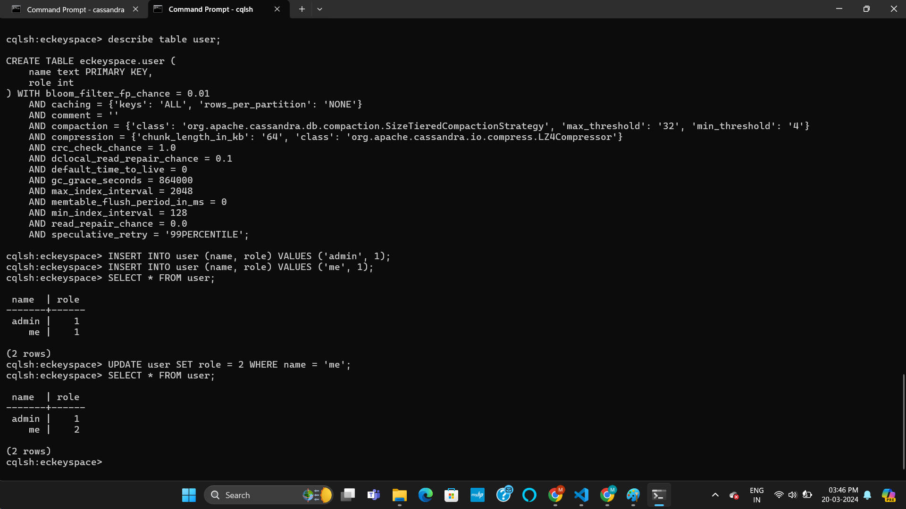
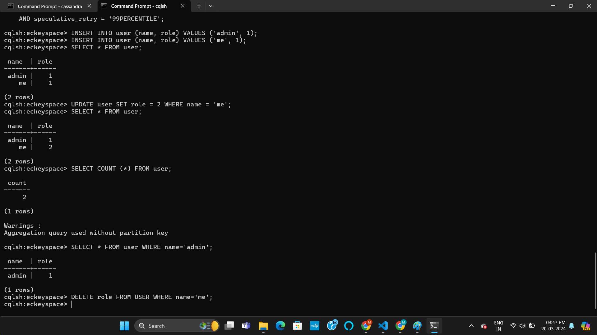
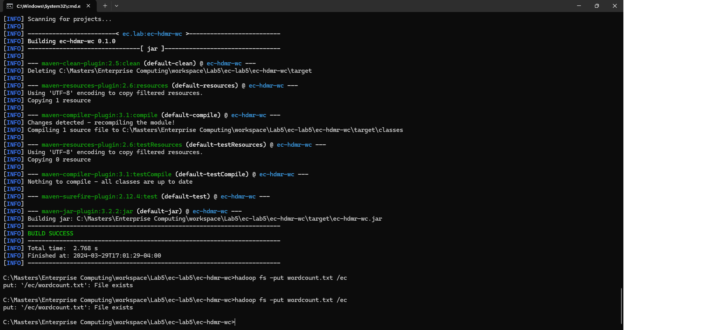
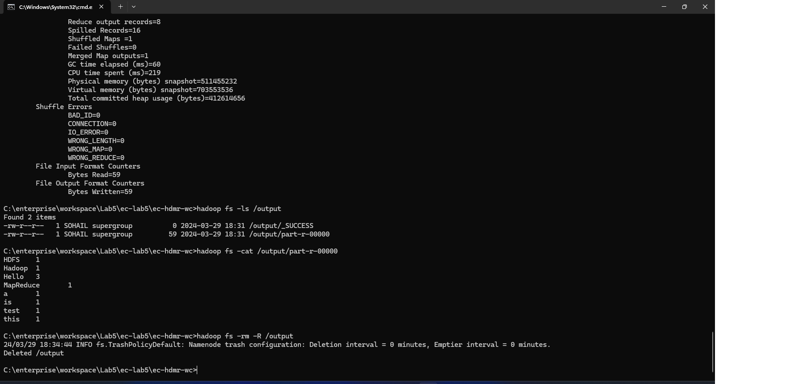

# LAB5 Report

Author: Mohammed Sohail Ahmed

Date: 2024-03-20

Check [readme.txt](readme.txt) for course work statement and self-evaluation.

# T1 Apache Cassandra (lab practice)

### T1.1 Cassandra installation

Complete? Yes

<!--If you answer Yes, insert a screenshot image to show the completion.-->

{width=90%}

<!-- If No, add a short description to describe the issues encountered.-->

### T1.2 CQL operations through cqlsh

Complete? Yes

<!--If you answer Yes, insert a screenshot image to show the completion.-->

{width=90%}
{width=90%}
{width=90%}
{width=90%}
{width=90%}
{width=90%}
{width=90%}
{width=90%}
{width=90%}
{width=90%}
{width=90%}
{width=90%}
{width=90%}
{width=90%}
{width=90%}
{width=90%}
{width=90%}
{width=90%}
{width=90%}
{width=90%}
{width=90%}
{width=90%}
{width=90%}
{width=90%}
{width=90%}
{width=90%}
{width=90%}

<!-- If No, add a short description to describe the issues encountered.-->

### T1.3 CQL programming in Java

Complete? Yes

<!--If you answer Yes, insert a screenshot image to show the completion.-->

{width=90%}

<!-- If No, add a short description to describe the issues encountered.-->

# T2 Apache Hadoop and HDFS (lab practice)

### T2.1 Hadoop installation

Complete? Yes

<!--If you answer Yes, insert a screenshot image to show the completion.-->

{width=90%}
{width=90%}
{width=90%}
{width=90%}
{width=90%}
{width=90%}
{width=90%}
{width=90%}
{width=90%}
{width=90%}

<!-- If No, add a short description to describe the issues encountered.-->

### T2.2 HDFS CLI operations

Complete? Yes or No

<!--If you answer Yes, insert a screenshot image to show the completion.-->

{width=90%}
{width=90%}
{width=90%}
{width=90%}
{width=90%}
{width=90%}
{width=90%}
{width=90%}
{width=90%}
{width=90%}
{width=90%}
{width=90%}
{width=90%}
{width=90%}
{width=90%}
{width=90%}
{width=90%}
{width=90%}
{width=90%}
{width=90%}
{width=90%}
{width=90%}
{width=90%}

<!-- If No, add a short description to describe the issues encountered.-->

### T2.3 HDFS client programming

Complete? Yes

<!--If you answer Yes, insert a screenshot image to show the completion.-->

{width=90%}

<!-- If No, add a short description to describe the issues encountered.-->

# T3 Hadoop MapReduce (lab practice)

### T3.1 Word counter example

Complete? Yes

<!--If you answer Yes, insert a screenshot image to show the completion.-->

{width=90%}
{width=90%}
{width=90%}
{width=90%}
{width=90%}
{width=90%}
{width=90%}

<!-- If No, add a short description to describe the issues encountered.-->

### T3.2 Kmeans by Hadoop MapReduce

Complete? Yes

<!--If you answer Yes, insert a screenshot image to show the completion.-->

{width=90%}
{width=90%}
{width=90%}
{width=90%}
{width=90%}
{width=90%}
{width=90%}
{width=90%}
{width=90%}

<!-- If No, add a short description to describe the issues encountered.-->

# T4 Apache Spark (lab practice)

### T4.1 Spark installation

Complete? Yes

<!--If you answer Yes, insert a screenshot image to show the completion.-->

{width=90%}
{width=90%}
{width=90%}
{width=90%}
{width=90%}
{width=90%}
{width=90%}
{width=90%}
{width=90%}
{width=90%}
{width=90%}
{width=90%}
{width=90%}
{width=90%}

<!-- If No, add a short description to describe the issues encountered.-->

### T4.2 Spark operations in Scala shell

Complete? Yes

<!--If you answer Yes, insert a screenshot image to show the completion.-->

{width=90%}
{width=90%}
{width=90%}
{width=90%}
{width=90%}
{width=90%}
{width=90%}
{width=90%}
{width=90%}
{width=90%}
{width=90%}
{width=90%}
{width=90%}
{width=90%}
{width=90%}
{width=90%}
{width=90%}
{width=90%}
{width=90%}
{width=90%}
{width=90%}
{width=90%}
{width=90%}
{width=90%}
{width=90%}
{width=90%}
{width=90%}
{width=90%}
{width=90%}
{width=90%}
{width=90%}
{width=90%}
{width=90%}
{width=90%}
{width=90%}
{width=90%}

<!-- If No, add a short description to describe the issues encountered.-->

### T4.3 MapReduce with Spark

Complete? Yes

<!--If you answer Yes, insert a screenshot image to show the completion.-->

{width=90%}
{width=90%}
{width=90%}
{width=90%}
{width=90%}
{width=90%}
{width=90%}
{width=90%}
{width=90%}

<!-- If No, add a short description to describe the issues encountered.-->

### T4.4 Spark programming in Java

Complete? Yes

<!--If you answer Yes, insert a screenshot image to show the completion.-->

{width=90%}
{width=90%}

<!-- If No, add a short description to describe the issues encountered.-->

**References**

1. CP630 lab5
2. Add your references if you used any.
